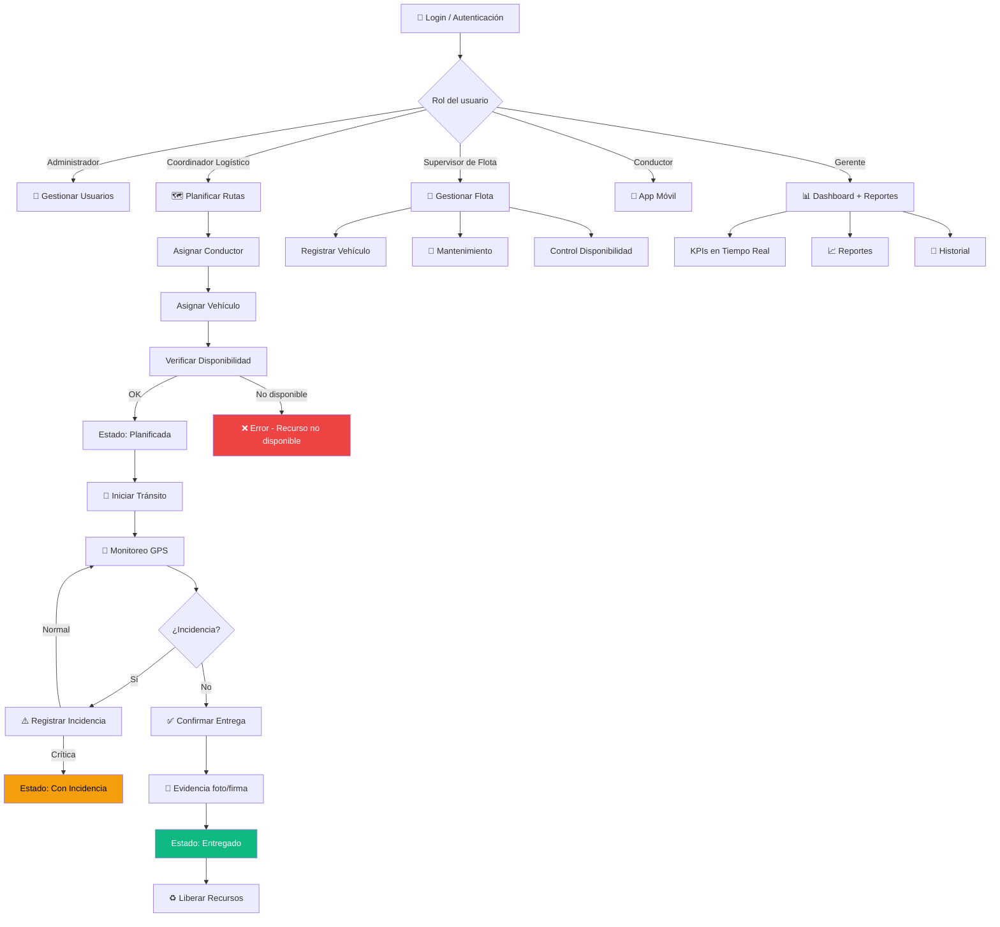

# 📋 GALAGA S.A.C. — Análisis Completo: Documento Académico vs Código Implementado

## Información del Proyecto

| Campo | Detalle |
|---|---|
| **Nombre Legal** | Servicios Generales Galaga S.A.C. |
| **Curso** | Análisis de Sistemas de Información — UTP |
| **Docente** | Eduardo Martin Reyes Rodriguez |
| **Grupo** | 16 — Avance de Proyecto Final 3 (APF3) |
| **Integrantes** | Tirabantes Córdova, Guevara Alhuay, Sánchez Hidalgo, Bravo Arellano, Malca Palacios |
| **Área de aplicación** | Gerencia de Operaciones y Logística |
| **Problema** | Deficiencias en planificación operativa, asignación de recursos y monitoreo de flota durante comicios electorales de abril 2026 |

---

## 🔍 Trazabilidad: Requerimientos del PDF vs Código Implementado

### Requerimientos Funcionales (RF-01 a RF-20)

| Código | Requerimiento | Estado | Evidencia en código |
|---|---|---|---|
| RF-01 | Gestión de usuarios (registrar, modificar, eliminar) | ⚠️ Parcial | Solo registro en [AuthController](file:///c:/D/UTP%20MARZO%202026/ANALISIS%20Y%20DISE%C3%91O%20DE%20SISTEMAS/GALAGA_SAC/backend/src/main/java/com/example/demo/controller/AuthController.java). **Falta**: editar y eliminar usuarios |
| RF-02 | Autenticación de usuarios (usuario/contraseña) | ✅ Completo | JWT + Spring Security en [SecurityConfig](file:///c:/D/UTP%20MARZO%202026/ANALISIS%20Y%20DISE%C3%91O%20DE%20SISTEMAS/GALAGA_SAC/backend/src/main/java/com/example/demo/security/SecurityConfig.java), [LoginComponent](file:///c:/D/UTP%20MARZO%202026/ANALISIS%20Y%20DISE%C3%91O%20DE%20SISTEMAS/GALAGA_SAC/frontend/src/app/components/login/login.component.ts) |
| RF-03 | Registro de vehículos | ✅ Completo | CRUD en [LogisticaController](file:///c:/D/UTP%20MARZO%202026/ANALISIS%20Y%20DISE%C3%91O%20DE%20SISTEMAS/GALAGA_SAC/backend/src/main/java/com/example/demo/controller/LogisticaController.java) + [FlotaComponent](file:///c:/D/UTP%20MARZO%202026/ANALISIS%20Y%20DISE%C3%91O%20DE%20SISTEMAS/GALAGA_SAC/frontend/src/app/components/flota/flota.component.ts) |
| RF-04 | Gestión de conductores | ✅ Completo | CRUD + estado en [ConductoresComponent](file:///c:/D/UTP%20MARZO%202026/ANALISIS%20Y%20DISE%C3%91O%20DE%20SISTEMAS/GALAGA_SAC/frontend/src/app/components/conductores/conductores.component.ts) |
| RF-05 | Asignación de vehículos a rutas/conductores | ✅ Completo | Validación de disponibilidad en [LogisticaService.planificarRuta()](file:///c:/D/UTP%20MARZO%202026/ANALISIS%20Y%20DISE%C3%91O%20DE%20SISTEMAS/GALAGA_SAC/backend/src/main/java/com/example/demo/service/LogisticaService.java#L83-L108) |
| RF-06 | Planificación de rutas | ✅ Completo | [RutasComponent](file:///c:/D/UTP%20MARZO%202026/ANALISIS%20Y%20DISE%C3%91O%20DE%20SISTEMAS/GALAGA_SAC/frontend/src/app/components/rutas/rutas.component.ts) con formulario completo |
| RF-07 | Monitoreo GPS en tiempo real | ⚠️ Parcial | Mapa con marcadores **mock** en [DashboardComponent L430-449](file:///c:/D/UTP%20MARZO%202026/ANALISIS%20Y%20DISE%C3%91O%20DE%20SISTEMAS/GALAGA_SAC/frontend/src/app/components/dashboard/dashboard.component.ts#L430-L449). **Usa Leaflet en vez de Google Maps (PDF dice Google Maps API)** |
| RF-08 | Registro de incidencias | ✅ Completo | [IncidenciasComponent](file:///c:/D/UTP%20MARZO%202026/ANALISIS%20Y%20DISE%C3%91O%20DE%20SISTEMAS/GALAGA_SAC/frontend/src/app/components/incidencias/incidencias.component.ts) + [IncidenciaEntregaService](file:///c:/D/UTP%20MARZO%202026/ANALISIS%20Y%20DISE%C3%91O%20DE%20SISTEMAS/GALAGA_SAC/backend/src/main/java/com/example/demo/service/IncidenciaEntregaService.java) |
| RF-09 | Gestión de contratos ONPE | ❌ No implementado | No existe entidad `Contrato` ni endpoint |
| RF-10 | Seguimiento de entregas | ✅ Completo | [EntregaComponent](file:///c:/D/UTP%20MARZO%202026/ANALISIS%20Y%20DISE%C3%91O%20DE%20SISTEMAS/GALAGA_SAC/frontend/src/app/components/entrega/entrega.component.ts) con confirmación |
| RF-11 | Alertas automáticas (retrasos, desvíos, incidencias) | ❌ No implementado | No hay sistema de notificaciones ni WebSockets |
| RF-12 | Control de disponibilidad de flota | ✅ Completo | Filtro por estado "Disponible" en repositorios |
| RF-13 | Generación de reportes | ❌ No implementado | No hay endpoint ni vista de reportes |
| RF-14 | Consulta histórica de operaciones | ❌ No implementado | No hay filtros por fecha ni historial |
| RF-15 | Gestión de mantenimiento vehicular | ❌ No implementado | No hay entidad `Mantenimiento` |
| RF-16 | Dashboard operativo con indicadores | ✅ Completo | [DashboardComponent](file:///c:/D/UTP%20MARZO%202026/ANALISIS%20Y%20DISE%C3%91O%20DE%20SISTEMAS/GALAGA_SAC/frontend/src/app/components/dashboard/dashboard.component.ts) con 4 KPIs |
| RF-17 | Confirmación de entrega (evidencia: foto/firma) | ⚠️ Parcial | Solo confirmación con texto. **Falta**: subida de fotos/firma digital |
| RF-18 | Gestión de almacenes (entradas/salidas de material) | ❌ No implementado | Solo se crea material, no se gestiona stock |
| RF-19 | Notificaciones a supervisores | ❌ No implementado | No hay sistema de notificaciones push |
| RF-20 | Auditoría de operaciones | ❌ No implementado | No hay registro de acciones/logs |

### Resumen de Cobertura Funcional

```
✅ Implementado completo:  8/20 (40%)
⚠️ Implementado parcial:  3/20 (15%)
❌ No implementado:        9/20 (45%)
```

---

### Requerimientos No Funcionales (RNF-01 a RNF-15)

| Código | Requerimiento | Estado | Nota |
|---|---|---|---|
| RNF-01 | Disponibilidad 99.5% | ❌ | No hay infraestructura de alta disponibilidad |
| RNF-02 | Seguridad (autenticación/autorización por roles) | ⚠️ | JWT implementado pero **sin autorización por roles** real |
| RNF-03 | Rendimiento (<3s consultas) | ⚠️ | Sin optimización de queries ni índices |
| RNF-04 | Escalabilidad | ⚠️ | Docker compose básico, sin orquestación |
| RNF-05 | Integridad de datos | ✅ | Constraints y FK en schema.sql |
| RNF-06 | Compatibilidad navegadores | ✅ | Angular es cross-browser |
| RNF-07 | Usabilidad | ✅ | UI con glassmorphism bien diseñada |
| RNF-08 | Mantenibilidad | ⚠️ | Sidebar duplicada, sin shared components |
| RNF-09 | Respaldo de información | ❌ | No hay backups configurados |
| RNF-10 | Geolocalización (Google Maps API) | ⚠️ | **Usa Leaflet, no Google Maps como dice el PDF** |
| RNF-11 | Trazabilidad/Auditoría | ❌ | No hay logs de operaciones |
| RNF-12 | Portabilidad (AWS/Azure) | ⚠️ | Docker parcial, sin Dockerfile para backend/frontend |
| RNF-13 | Disponibilidad móvil (smartphones/tablets) | ❌ | **No hay app móvil para conductores** |
| RNF-14 | Confiabilidad (recuperación ante fallos) | ❌ | No hay mecanismos de recovery |
| RNF-15 | Cumplimiento normativo (MTC/ONPE) | N/A | Fuera del alcance técnico |

---

### Casos de Uso del PDF vs Implementación

| Código | Caso de Uso | Actor | Implementado |
|---|---|---|---|
| CU-01 | Iniciar Sesión | Todos | ✅ |
| CU-02 | Gestionar Usuarios | Administrador | ⚠️ Solo registro |
| CU-03 | Registrar Vehículo | Supervisor de Flota | ✅ |
| CU-04 | Registrar Conductor | Coordinador Logístico | ✅ |
| CU-05 | Planificar Ruta | Coordinador Logístico | ✅ |
| CU-06 | Asignar Vehículo y Conductor | Coordinador Logístico | ✅ (integrado en CU-05) |
| CU-07 | Monitorear Flota en Tiempo Real | Supervisor | ⚠️ Mock con Leaflet |
| CU-08 | Registrar Incidencia | Conductor | ✅ |
| CU-09 | Gestionar Contratos ONPE | Gerente | ❌ |
| CU-10 | Registrar Entrega de Material | Conductor | ✅ |
| CU-11 | Generar Reportes | Gerente | ❌ |
| CU-12 | Gestionar Mantenimiento Vehicular | Supervisor de Flota | ❌ |
| CU-13 | Consultar Historial de Operaciones | Gerente | ❌ |
| CU-14 | Recibir Alertas de Retraso | Sistema | ❌ |
| CU-15 | Visualizar Dashboard Operativo | Gerente/Supervisores | ✅ |

---

## ⚠️ Discrepancias Clave entre PDF y Código

> [!WARNING]
> Las siguientes discrepancias podrían ser problemáticas si el docente evalúa la coherencia entre el documento y la implementación.

| # | Lo que dice el PDF | Lo que está implementado | Riesgo |
|---|---|---|---|
| 1 | **Google Maps API** para geolocalización | **Leaflet.js** con tiles de CartoDB | 🔴 Alto |
| 2 | **MySQL** como base de datos | **PostgreSQL** (correcto en despliegue, pero inconsistente con sección 3.8.1) | 🟡 Medio |
| 3 | **6 Controllers** separados (UsuarioController, VehiculoController, RutaController, IncidenciaController, EntregaController, ReporteController) | **3 Controllers** agrupados (Auth, Logistica, IncidenciaEntrega) | 🟡 Medio |
| 4 | **Micro-servicios modulares** (sección 3.8.5) | Aplicación **monolítica** en Spring Boot | 🟡 Medio |
| 5 | **App móvil** para conductores (Cliente Móvil) | **Solo aplicación web** | 🔴 Alto |
| 6 | **API Gateway** con JWT centralizado | Filtro JWT directo en la app | 🟢 Menor |
| 7 | Entidad **Centro de Votación** en tarjetas CRC | No existe en el modelo | 🟡 Medio |
| 8 | Entidad **Almacén** en tarjetas CRC | No existe en el modelo | 🟡 Medio |
| 9 | **Spring Boot 3.x** en el PDF | **Spring Boot 4.1.0** en pom.xml | 🟢 Menor |
| 10 | **Firma/fotografía** como evidencia de entrega | Solo texto en observaciones | 🟡 Medio |

---

## ⚠️ Problemas Técnicos Detectados en el Código

### 🔴 Críticos

| # | Problema | Ubicación |
|---|---|---|
| 1 | **JWT Secret hardcodeado** en código fuente | [JwtTokenProvider.java L15](file:///c:/D/UTP%20MARZO%202026/ANALISIS%20Y%20DISE%C3%91O%20DE%20SISTEMAS/GALAGA_SAC/backend/src/main/java/com/example/demo/security/JwtTokenProvider.java#L15) |
| 2 | **Credenciales de BD hardcodeadas** | [application.yml L6-7](file:///c:/D/UTP%20MARZO%202026/ANALISIS%20Y%20DISE%C3%91O%20DE%20SISTEMAS/GALAGA_SAC/backend/src/main/resources/application.yml#L6-L7) |
| 3 | **Sin Auth Guards** en frontend — acceso libre a todas las rutas | [app.routes.ts](file:///c:/D/UTP%20MARZO%202026/ANALISIS%20Y%20DISE%C3%91O%20DE%20SISTEMAS/GALAGA_SAC/frontend/src/app/app.routes.ts) |
| 4 | **Sin autorización por roles** (PDF exige RNF-02) | Controllers sin `@PreAuthorize` |
| 5 | **Conflicto schema.sql vs JPA ddl-auto:update** | Riesgo de DROP + recreación de tablas |

### 🟡 Importantes

| # | Problema | Ubicación |
|---|---|---|
| 6 | **Sidebar duplicada** en 7 componentes (~1,400 líneas repetidas) | Todos los componentes |
| 7 | **Sin HTTP Interceptor** para JWT | Frontend services |
| 8 | **Uso de `any`** en todo el TypeScript | [logistica.service.ts](file:///c:/D/UTP%20MARZO%202026/ANALISIS%20Y%20DISE%C3%91O%20DE%20SISTEMAS/GALAGA_SAC/frontend/src/app/services/logistica.service.ts) |
| 9 | **RuntimeException genérica** como manejo de errores | Backend services |
| 10 | **GroupId/ArtifactId genéricos** (`com.example:demo`) | [pom.xml L11-12](file:///c:/D/UTP%20MARZO%202026/ANALISIS%20Y%20DISE%C3%91O%20DE%20SISTEMAS/GALAGA_SAC/backend/pom.xml#L11-L12) |
| 11 | **Sin operaciones UPDATE/DELETE** en ningún CRUD | Controllers |
| 12 | **Falta `@CrossOrigin`** o configuración CORS por entorno | Hardcoded `localhost:4200` |

### 🟢 Menores

| # | Problema | Ubicación |
|---|---|---|
| 13 | Sin tests unitarios reales | `src/test` |
| 14 | README vacío | [README.md](file:///c:/D/UTP%20MARZO%202026/ANALISIS%20Y%20DISE%C3%91O%20DE%20SISTEMAS/GALAGA_SAC/README.md) |
| 15 | Leaflet cargado desde CDN global | [index.html L10-12](file:///c:/D/UTP%20MARZO%202026/ANALISIS%20Y%20DISE%C3%91O%20DE%20SISTEMAS/GALAGA_SAC/frontend/src/index.html#L10-L12) |
| 16 | Contraseña de seed expuesta en comentario | [data.sql L2](file:///c:/D/UTP%20MARZO%202026/ANALISIS%20Y%20DISE%C3%91O%20DE%20SISTEMAS/GALAGA_SAC/backend/src/main/resources/data.sql#L2) |

---

## 🚀 Plan de Mejoras Priorizadas (Alineado con el PDF)

### Fase 1: Alineación Crítica con el Documento (Prioridad MÁXIMA)

> [!CAUTION]
> Estas mejoras son necesarias para que el código sea coherente con lo que describe el documento académico.

#### 1.1 Implementar autorización por roles (RF-01, RNF-02)
- Agregar `@PreAuthorize("hasRole('ADMIN')")` en endpoints administrativos
- Crear `AuthGuard` y `RoleGuard` en Angular
- Roles del PDF: **Administrador**, **Gerente de Operaciones**, **Coordinador Logístico**, **Supervisor de Flota**, **Conductor**, **Operador de Almacén**

#### 1.2 Completar CRUD de usuarios (RF-01, CU-02)
- Agregar endpoints `PUT /api/usuarios/{id}` y `DELETE /api/usuarios/{id}`
- Crear componente `UsuariosComponent` en frontend
- Agregar ruta en sidebar

#### 1.3 Alinear nomenclatura del PDF
- Cambiar `com.example.demo` → `com.galaga.sac`
- Separar controllers como dice el PDF: `UsuarioController`, `VehiculoController`, `RutaController`, `IncidenciaController`, `EntregaController`

---

### Fase 2: Funcionalidades Faltantes de Alta Prioridad

#### 2.1 Gestión de contratos ONPE (RF-09, CU-09)
- Crear entidad `Contrato` (id, número, fechaInicio, fechaFin, servicios, condiciones, estado)
- Controller + Service + Repository
- Componente Angular con formulario y tabla

#### 2.2 Generación de reportes (RF-13, CU-11)
- Endpoint `GET /api/reportes/cumplimiento`
- Endpoint `GET /api/reportes/incidencias`
- Endpoint `GET /api/reportes/rendimiento`
- Vista con filtros por fecha y exportación a PDF/Excel

#### 2.3 Alertas automáticas (RF-11, RF-19, CU-14)
- Implementar notificaciones para incidencias críticas
- Alertas por retrasos en rutas "En Tránsito" excedidas en tiempo

#### 2.4 Consulta histórica (RF-14, CU-13)
- Agregar paginación + filtros por fecha/estado a todos los endpoints
- Vista de historial con filtros avanzados

#### 2.5 Gestión de mantenimiento vehicular (RF-15, CU-12)
- Crear entidad `Mantenimiento` (id, idVehiculo, tipo [preventivo/correctivo], fecha, descripcion, costo, estado)
- Vehículos en mantenimiento cambian estado a "En Mantenimiento"

---

### Fase 3: Mejoras Arquitectónicas

#### 3.1 Extraer Sidebar como SharedLayoutComponent
- Crear componente compartido con `<router-outlet>`
- Eliminar ~1,400 líneas de código duplicado en 7 componentes

#### 3.2 Implementar HTTP Interceptor
- `JwtInterceptor` para inyectar token automáticamente
- `ErrorInterceptor` para manejo centralizado de errores 401/403/500

#### 3.3 Crear interfaces TypeScript
```typescript
// Ejemplo de interfaces a crear
interface Conductor { idConductor: number; nombre: string; licencia: string; telefono: string; estado: string; }
interface Vehiculo { idVehiculo: number; placa: string; tipo: string; capacidad: number; estado: string; gps: string; }
interface Ruta { idRuta: number; origen: string; destino: string; ... }
```

#### 3.4 Manejo de errores centralizado en Backend
- `@ControllerAdvice` con `GlobalExceptionHandler`
- Excepciones custom (`ResourceNotFoundException`, `BusinessRuleException`)

---

### Fase 4: Seguridad y Configuración

#### 4.1 Externalizar secretos
- JWT secret → variable de entorno
- Credenciales de BD → variables de entorno
- Agregar `.env.example` al repositorio

#### 4.2 Completar operaciones CRUD
- Agregar `PUT` y `DELETE` en todos los controllers (conductores, vehículos, operadores, rutas)
- Validar integridad referencial antes de eliminar

#### 4.3 Auditoría de operaciones (RF-20)
- Agregar tabla `auditoria` (id, usuario, accion, entidad, timestamp, detalles)
- Implementar con `@EntityListeners` de JPA

---

### Fase 5: Mejoras Avanzadas (Alineadas con PDF)

| Mejora | Referencia PDF | Complejidad |
|---|---|---|
| **Integración Google Maps API** (reemplazar Leaflet) | RNF-10, RF-07 | Alta |
| **App móvil PWA** para conductores | Diagrama de Despliegue (Cliente Móvil) | Alta |
| **Gestión de almacenes** | RF-18, Tarjeta CRC Almacén | Media |
| **Evidencia digital de entrega** (foto/firma) | RF-17 | Media |
| **Entidad Centro de Votación** | Tarjeta CRC | Baja |
| **Docker Compose completo** (backend + frontend + nginx) | RNF-12 | Media |
| **WebSockets** para monitoreo real-time | RF-07, RNF-01 | Alta |
| **Tests unitarios** (JUnit + Mockito + Jasmine) | Calidad | Media |

---

## Flujo de Negocio Completo (según PDF)



---

## Resumen Ejecutivo

| Métrica | Valor |
|---|---|
| **Requerimientos funcionales implementados** | 8 de 20 (40%) + 3 parciales (15%) |
| **Casos de uso implementados** | 8 de 15 (53%) |
| **Requerimientos no funcionales cubiertos** | 3 de 15 (20%) |
| **Entidades implementadas vs diseñadas** | 8 de 8 principales ✅ (Faltan: Contrato, Mantenimiento, CentroVotación, Almacén) |
| **Discrepancias PDF vs código** | 10 identificadas |
| **Problemas técnicos** | 16 (5 críticos, 7 importantes, 4 menores) |

> [!IMPORTANT]
> **Recomendación de priorización**: Si tienes una entrega próxima, sugiero empezar por **Fase 1** (alinear con el PDF) y **Fase 2** (funcionalidades faltantes de alta prioridad), ya que son las que más impactan la evaluación académica al demostrar coherencia entre el documento y la implementación.

> [!NOTE]
> Puedo empezar a implementar las mejoras que elijas. Dime qué fase o mejoras específicas quieres que desarrolle primero.
